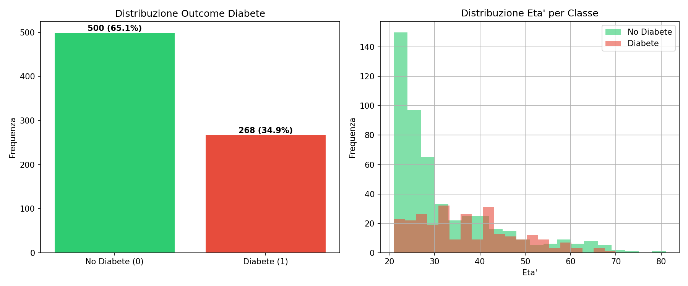
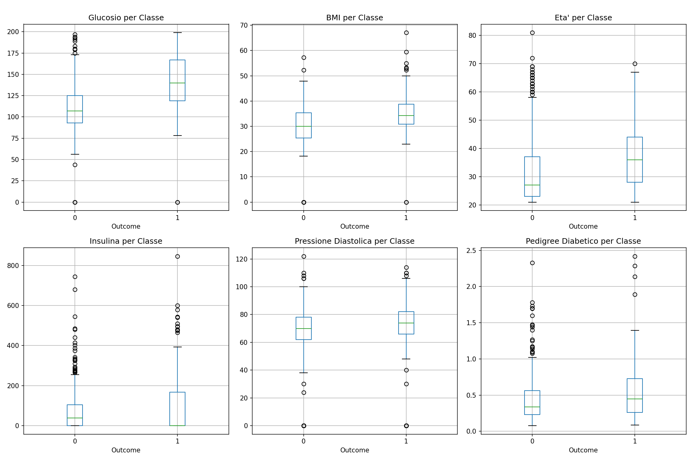
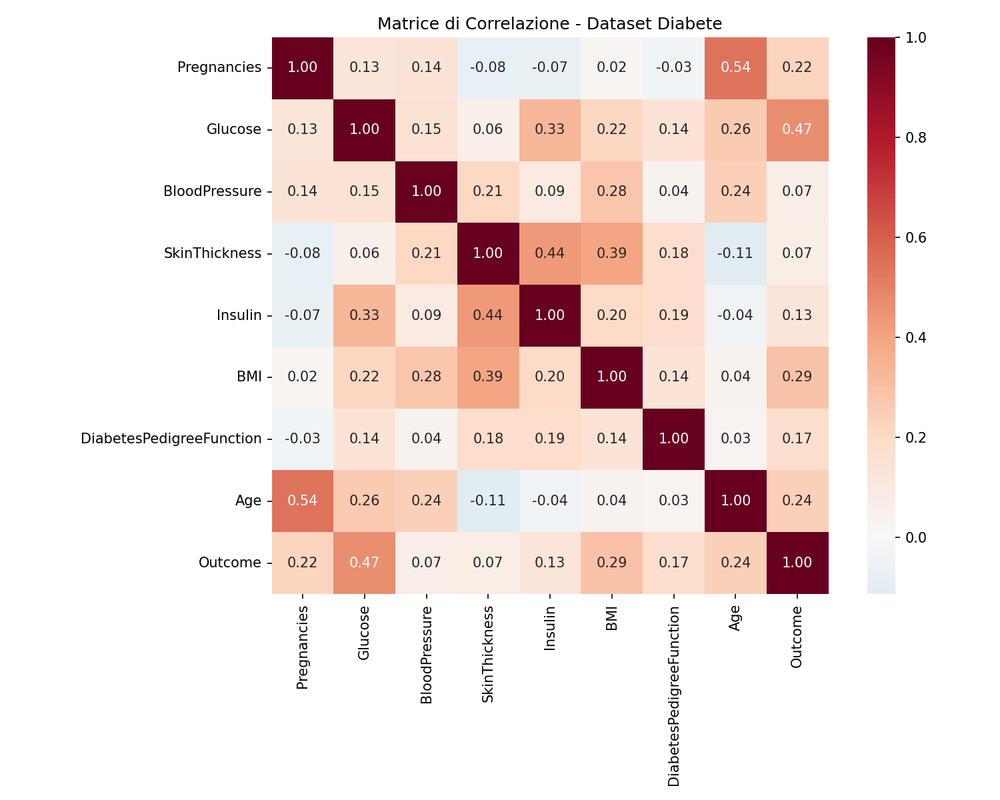
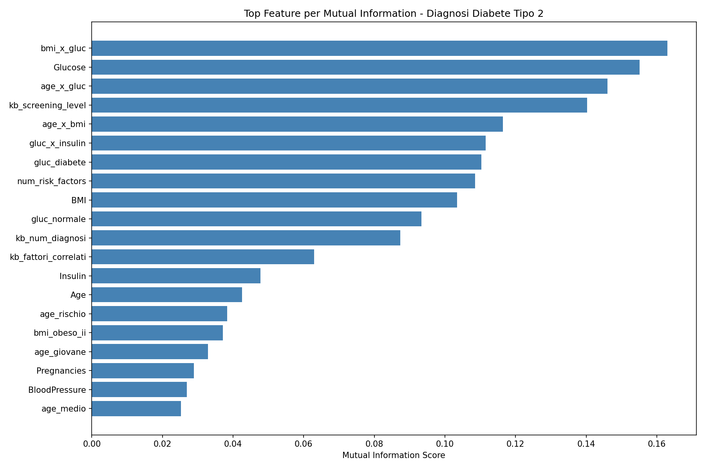
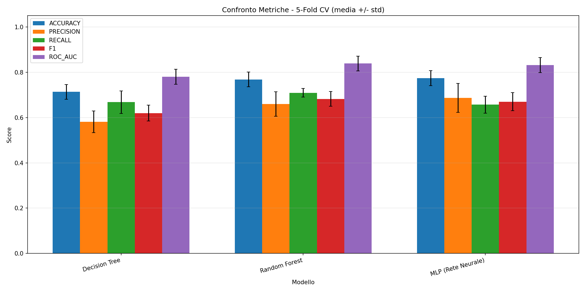
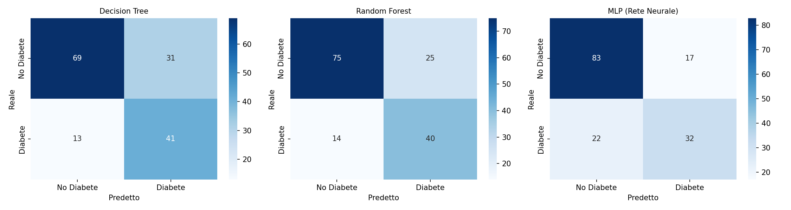
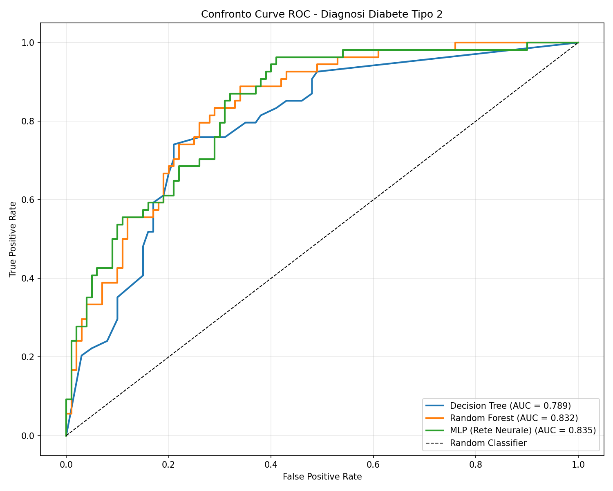
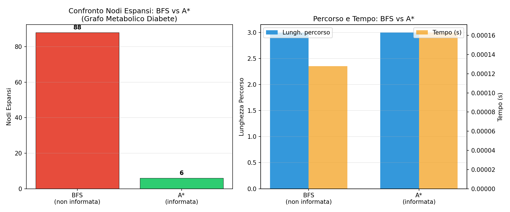

# DiabetesT2-DSS: Sistema Intelligente di Supporto Decisionale per il Diabete di Tipo 2

## Informazioni

**Autore:** Vanessa Antonia Dellaquila

**Matricola:** 802272

**Email:** [v.dellaquila3@studenti.uniba.it](mailto:v.dellaquila3@studenti.uniba.it)

**Anno Accademico:** 2025-2026

**Repository:** [https://github.com/Vanessa049/DiabetesT2-DSS.git](https://github.com/Vanessa049/Progetto_DiabetesT2-DSS.git)

---

## Indice

- **[Introduzione](#introduzione)**
  - [Obiettivo del Sistema](#obiettivo-del-sistema)
  - [Architettura e Pipeline](#architettura-e-pipeline)
  - [Elenco degli Argomenti Affrontati](#elenco-degli-argomenti-affrontati)
  - [Dataset](#dataset)
  - [Analisi Esplorativa dei Dati](#analisi-esplorativa-dei-dati)

- **[Capitolo 1) Rappresentazione della Conoscenza e Ragionamento Logico](#capitolo-1-rappresentazione-della-conoscenza-e-ragionamento-logico)**
  - [Obiettivo del Modulo](#obiettivo-del-modulo)
  - [Strumenti e Tecnologie](#strumenti-e-tecnologie)
  - [Scelte Implementative](#scelte-implementative)
    - [Scelta delle soglie cliniche](#scelta-delle-soglie-cliniche)
    - [Inferenza multi-livello](#inferenza-multi-livello)
    - [Diagnosi abduttiva](#diagnosi-abduttiva)
    - [Rilevamento sindrome metabolica](#rilevamento-sindrome-metabolica)
    - [Correlazione tra fattori metabolici](#correlazioni-tra-fattori-metabolici)
    - [Feature derivate per il ML](#feature-derivate-per-il-ml)
    - [Complessità della KB](#complessità-della-kb)
    - [Gestione della dipendenza da SWI-Prolog](#gestione-della-dipendenza-da-swi-prolog)
  - [Risultati e Valutazione Sperimentale](#risultati-e-valutazione-sperimentale)

- **[Capitolo 2) Apprendimento Supervisionato per la Diagnosi Predittiva](#capitolo-2-apprendimento-supervisionato-per-la-diagnosi-predittiva)**
  - [Obiettivo del Modulo](#obiettivo-del-modulo-1)
  - [Strumenti e Tecnologie](#strumenti-e-tecnologie-1)
  - [Scelte Implementative](#scelte-implementative-1)
    - [Preprocessing e gestione dei missing values](#preprocessing-e-gestione-dei-missing-values)
    - [Feature engineering](#feature-engineering)
    - [Feature selection](#feature-selection)
    - [Hyperparameter tuning](#hyperparameter-tuning)
    - [Valutazione e cross-validation](#valutazione-e-cross-validation)
  - [Risultati e Valutazione Sperimentale](#risultati-e-valutazione-sperimentale-1)

- **[Capitolo 3) Soddisfacimento di Vincoli e Ricerca Euristica](#capitolo-3-soddisfacimento-di-vincoli-e-ricerca-euristica)**
  - [Obiettivo del Modulo](#obiettivo-del-modulo-2)
  - [Strumenti e Tecnologie](#strumenti-e-tecnologie-2)
  - [Scelte Implementative](#scelte-implementative-2)
    - [CSP: Assegnamento Piani di Intervento](#csp-assegnamento-piani-di-intervento)
    - [Ricerca su Grafo: BFS vs A*](#ricerca-su-grafo-bfs-vs-a)
  - [Risultati e Valutazione Sperimentale](#risultati-e-valutazione-sperimentale-2)
    - [CSP - Risultati assegnamento piani (6 pazienti ad alto rischio)](#csp--risultati-assegnamento-piani-6-pazienti-ad-alto-rischio)
    - [Ricerca su Grafo - Confronto BFS vs A*](#ricerca-su-grafo--confronto-bfs-vs-a)

- **[Integrazione Multi-Paradigma e Valutazione Complessiva](#integrazione-multi-paradigma-e-valutazione-complessiva)**
  - [Architettura del Sistema Integrato](#architettura-del-sistema-integrato)
  - [Risultati Complessivi](#risultati-complessivi)

- **[Limiti del Sistema](#limiti-del-sistema)**

- **[Sviluppi Futuri](#sviluppi-futuri)**

- **[Riferimenti Bibliografici](#riferimenti-bibliografici)**

---

# Introduzione

### Obiettivo del Sistema

**DiabetesT2-DSS** è un Knowledge-Based System (KBS) per il supporto alla diagnosi precoce e alla gestione del rischio del diabete di tipo 2, che integra rappresentazione della conoscenza simbolica, apprendimento automatico e ottimizzazione combinatoria in un'unica pipeline decisionale.

Il sistema persegue quattro obiettivi:

- rappresentare la conoscenza medica delle linee guida ADA 2023 in una Knowledge Base Prolog e utilizzarla per ragionamento automatico (classificazione del rischio metabolico, diagnosi abduttiva, derivazione di feature);
- addestrare modelli di classificazione supervisionata che integrano le feature derivate dalla KB, misurandone il contributo con uno studio di ablazione;
- ottimizzare l'assegnamento di piani di intervento lifestyle/farmacologici tramite CSP e confrontare strategie di ricerca informata/non informata sul grafo di similarità tra pazienti;
- comporre i tre moduli in un'unica strategia decisionale adattiva.

### Architettura e Pipeline

Il progetto è organizzato come package Python con responsabilità separate, percorsi e costanti centralizzati in un unico modulo di configurazione, e un'interfaccia a linea di comando che orchestra le fasi della pipeline:

```
DiabetesT2-DSS/
├── main.py                       # CLI: orchestra le fasi della pipeline
├── config.py                     # percorsi e costanti condivise da tutti i moduli
├── data/diabetes.csv             # dataset PIMA (UCI)
├── knowledge_base/
│   └── diabetes_rules.pl         # Knowledge Base Prolog (ADA 2023)
├── src/
│   ├── data_processing.py        # EDA, missing values, feature engineering
│   ├── reasoning.py              # interfaccia Python-Prolog
│   ├── supervised_learning.py    # training/CV/ablazione ML
│   ├── intervention_planner.py   # CSP per piani di intervento
│   ├── graph_search.py           # BFS vs A* su grafo metabolico
│   └── integration.py            # score adattivo KB + ML + CSP
└── results/                      # output generati a runtime, organizzati per tipo
    ├── data/                     #   dataset intermedi e tabelle (CSV/TXT)
    ├── models/                   #   modello migliore serializzato + scaler
    ├── figures/
    │   ├── eda/                  #   grafici dell'analisi esplorativa
    │   ├── ml/                   #   grafici dell'apprendimento supervisionato
    │   └── search/               #   grafico di confronto BFS vs A*
    └── reports/                  #   report testuali di ciascuna fase
```

Ogni fase scrive esclusivamente nella propria sottocartella: il preprocessing in `results/data/` e `results/figures/eda/`, l'apprendimento in `results/models/`, `results/figures/ml/` e `results/data/` (tabella di confronto), CSP e ricerca su grafo in `results/figures/search/` e `results/reports/`. Tutti i percorsi sono costanti definite in `config.py` (es. `config.EDA_TARGET_PLOT_PATH`, `config.BEST_MODEL_PATH`): nessun modulo concatena stringhe di percorso "a mano", il che rende la struttura delle cartelle modificabile in un solo punto.

La pipeline è **circolare**: ogni fase alimenta la successiva, e l'ordine di esecuzione non è arbitrario ma riflette una dipendenza di dati reale.

1. **Preprocessing** (`src/data_processing.py`): caricamento dati, gestione missing values, feature engineering su soglie cliniche ADA 2023.
2. **Ragionamento KB** (`src/reasoning.py` + `knowledge_base/diabetes_rules.pl`): classificazione del rischio diabetico, diagnosi abduttiva, derivazione di 4 feature numeriche — **deve precedere l'apprendimento**, perché le feature KB vengono aggiunte al dataset di training.
3. **Apprendimento Supervisionato** (`src/supervised_learning.py`): tre modelli con tuning, 5-fold CV, studio di ablazione KB.
4. **Pianificazione CSP e Ricerca su Grafo** (`src/intervention_planner.py`, `src/graph_search.py`): assegnamento piani di intervento; confronto BFS vs A*.
5. **Integrazione** (`src/integration.py`): strategia adattiva che combina KB, ML e CSP in base alla confidenza del modello.

Ogni fase è eseguibile singolarmente da `main.py`, che importa i moduli "pigramente" fase per fase: questo permette, ad esempio, di eseguire `--preprocess` o `--search` senza dover installare SWI-Prolog o `python-constraint`, necessari solo per `--reason`, `--plan` e `--integrate`.

```bash
python main.py --all          # pipeline completa
python main.py --preprocess   # solo fase 1
python main.py --reason       # solo fase 2
python main.py --learn        # solo fase 3
python main.py --plan         # solo CSP
python main.py --search       # solo ricerca su grafo
python main.py --integrate    # solo fase 5
```

### Elenco degli Argomenti Affrontati

- **Rappresentazione della Conoscenza e Ragionamento**: Knowledge Base in Prolog con clausole di Horn, inferenza multi-livello (parametri clinici → fattori di rischio → livello di rischio → raccomandazione), diagnosi abduttiva, negation-as-failure, meta-ragionamento con `findall/3`.
- **Apprendimento Supervisionato**: classificazione binaria con Decision Tree, Random Forest e MLP; tuning con `GridSearchCV`; validazione con Stratified K-Fold Cross-Validation; feature selection con mutual information; studio di ablazione per misurare il contributo della KB.
- **Soddisfacimento di Vincoli (CSP)**: assegnamento di piani di intervento clinico come problema a vincoli, con vincoli hard (compatibilità clinica, `AllDifferentConstraint`) e ottimizzazione multi-obiettivo sui vincoli soft.
- **Ricerca su Grafi**: confronto tra ricerca non informata (BFS) e ricerca informata (A\*) su un grafo di similarità metabolica tra pazienti, con euristica ammissibile.

### Dataset

Il dataset utilizzato è il *Pima Indians Diabetes Dataset* (UCI Machine Learning Repository), composto da 768 pazienti di sesso femminile di origine Pima, descritti da 8 feature cliniche (numero di gravidanze, glucosio plasmatico a digiuno, pressione diastolica, spessore plica cutanea tricipitale, insulina sierica a 2 ore, BMI, funzione pedigree diabetico, età) con variabile target binaria `Outcome` (0 = no diabete, 1 = diabete).

### Analisi Esplorativa dei Dati

Il dataset presenta uno sbilanciamento moderato tra le classi, visibile nella distribuzione della variabile target:



Le distribuzioni dei principali parametri clinici, suddivise per esito (sano/diabete), mostrano separazioni evidenti per Glucose e BMI — coerenti con le soglie ADA/WHO usate nella Knowledge Base del Capitolo 1 — e maggiore sovrapposizione per feature come BloodPressure:



La matrice di correlazione tra le feature numeriche evidenzia le relazioni più forti con la variabile target (Glucose, BMI, Age) e alcune collinearità attese tra feature originali e derivate (es. BMI e le relative interazioni):



---

# Capitolo 1) Rappresentazione della Conoscenza e Ragionamento Logico

> **In sintesi:** una Knowledge Base Prolog di ~320 righe traduce le linee guida ADA 2023 in inferenza multi-livello (fatti clinici → fattori di rischio → livello di rischio → screening), diagnosi abduttiva e correlazioni metaboliche. Le 4 feature numeriche derivate vengono iniettate nel modulo di apprendimento del Capitolo 2; `kb_screening_level` risulta tra le feature più informative dell'intero dataset (4ª posizione per mutual information).

## Obiettivo del Modulo

Il modulo di ragionamento si basa su una Knowledge Base in Prolog (`knowledge_base/diabetes_rules.pl`), costituita da clausole di Horn definite. I fatti dinamici (`paziente/5`, `esame/3`) vengono popolati a runtime dal modulo `src/reasoning.py` (classe `KnowledgeBaseReasoner`) a partire dai dati clinici preprocessati. Le regole codificano conoscenza medica proveniente dalle *ADA Standards of Medical Care in Diabetes 2023*, con soglie cliniche validate internazionalmente.

La KB implementa:

- **Classificazione del rischio diabetico** con inferenza multi-livello: dai fatti clinici si derivano fattori di rischio metabolici, dai fattori il livello di rischio (critico/alto/moderato/basso), dal rischio le raccomandazioni di screening.
- **Diagnosi abduttiva**: dato un paziente, la KB spiega *quali* fattori metabolici contribuiscono alla classificazione, elencando fino a 10 cause diagnostiche.
- **Correlazioni tra fattori di rischio metabolici**: 10 coppie cliniche note (es. obesità↔insulino-resistenza, ipertensione↔sindrome metabolica) codificate come background knowledge.
- **Derivazione di feature per il ML**: 4 feature numeriche sintetizzano l'output della KB e vengono aggiunte al dataset di training.

## Strumenti e Tecnologie

- SWI-Prolog (motore inferenziale)
- pyswip (interfaccia Python-Prolog, classe `KnowledgeBaseReasoner` in `src/reasoning.py`)

## Scelte Implementative

### Scelta delle soglie cliniche

Le soglie per la classificazione dei parametri sono state derivate da linee guida mediche internazionali validate:

- *Glucosio* secondo ADA 2023: < 100 mg/dL normale, 100-125 mg/dL pre-diabete (IFG), ≥ 126 mg/dL diabete diagnostico.
- *BMI* secondo WHO: < 25 normale, 25-29.9 sovrappeso, 30-34.9 obeso classe I, ≥ 35 obeso classe II+.
- *Pressione diastolica* secondo JNC 8: < 80 mmHg normale, 80-89 ipertensione stadio 1, ≥ 90 ipertensione stadio 2.
- *Insulina sierica*: > 130 µU/mL come soglia di probabile insulino-resistenza, conforme alla letteratura clinica.
- *Pedigree diabetico* (DiabetesPedigreeFunction): soglia 0.5 per storia familiare moderata, 0.8 per storia familiare forte, calibrate sulla distribuzione del dataset PIMA.

Questa scelta garantisce che le regole codifichino conoscenza medica validata e non soglie arbitrarie ottimizzate sui dati.

### Inferenza multi-livello

La catena inferenziale procede su tre livelli:

1. i fatti clinici attivano regole sui singoli fattori (es. `glicemia_prediabete/1`, `bmi_obeso/1`, `ipertensione_diastolica/1`);
2. la combinazione di fattori determina il livello di rischio tramite 7 regole per `rischio_critico`, 4 regole per `rischio_alto`, 3 regole per `rischio_moderato` e 1 regola di default per `rischio_basso` (`knowledge_base/diabetes_rules.pl`, righe 139-204);
3. il livello di rischio determina la raccomandazione di screening (OGTT immediato, HbA1c trimestrale, screening annuale, screening triennale). Ogni livello è una catena di clausole di Horn che sfrutta unificazione e backtracking di Prolog. Il predicato `screening_level/2` codifica questa catena in un valore numerico 0-3 usato come feature per il ML (`knowledge_base/diabetes_rules.pl`, righe 314-318).

### Diagnosi abduttiva

Per ogni paziente, il predicato `diagnosi_rischio/2` (`knowledge_base/diabetes_rules.pl`, righe 250-281) identifica quali tra 10 possibili fattori diagnostici sono presenti: glicemia da diabete, glicemia pre-diabetica, obesità, obesità severa, ipertensione diastolica, insulino-resistenza probabile, adiposità viscerale, età avanzata (≥ 45 anni), storia familiare forte, rischio da gravidanze multiple (GDM). Il conteggio avviene con `findall/3` nel predicato `conta_diagnosi/2`. Questo approccio implementa una forma di ragionamento abduttivo: data l'osservazione (rischio alto), si cercano le spiegazioni (fattori metabolici contribuenti). Lato Python, il metodo `KnowledgeBaseReasoner.diagnose_patient()` (`src/reasoning.py`, riga 125) esegue la query e ne raccoglie i risultati.

### Rilevamento sindrome metabolica

La KB include la regola `sindrome_metabolica/1` (`knowledge_base/diabetes_rules.pl`, righe 304-307) che rileva la co-presenza di obesità, ipertensione diastolica e iperinsulinemia. Questa triade è clinicamente rilevante come predittore indipendente del diabete T2 e della malattia cardiovascolare; la sua codifica come regola separata permette di usarla sia come raccomandazione di screening che come informazione diagnostica aggiuntiva. Il rilevamento utilizza negation-as-failure (`\+`) per distinguere il caso standard dal profilo metabolico aggravato, coerentemente con il formalismo di clausole di Horn adottato dall'intera KB.

### Correlazioni tra fattori metabolici

La KB codifica 10 correlazioni cliniche note (`knowledge_base/diabetes_rules.pl`, righe 115-128): obesità↔insulino-resistenza, obesità↔ipertensione, obesità↔glicemia_alta, insulino-resistenza↔glicemia_alta, età_avanzata↔insulino-resistenza, età_avanzata↔ipertensione, storia_familiare↔rischio_genetico, GDM↔diabete_futuro, ipertensione↔sindrome_metabolica. Per ogni paziente, il predicato `conta_coppie_correlate/2` (`knowledge_base/diabetes_rules.pl`, righe 344-365) conta quante coppie di fattori correlati sono co-presenti, catturando interazioni metaboliche note che un modello ML potrebbe non apprendere autonomamente da un dataset di 768 esempi. Il valore aggiunto è strutturale: le correlazioni codificano *background knowledge* medica validata, indipendente dai dati statistici.

### Feature derivate per il ML

La KB genera 4 feature che vengono aggiunte al dataset di training tramite il metodo `derive_kb_features()` (`src/reasoning.py`, riga 153):

| Feature | Tipo | Descrizione |
|---------|------|-------------|
| `kb_screening_level` | 0-3 | Livello di screening raccomandato (catena inferenziale multi-livello ADA 2023) |
| `kb_num_diagnosi` | 0-10 | Conteggio fattori dalla diagnosi abduttiva |
| `kb_fattori_correlati` | 0-6 | Coppie di fattori metabolici correlati co-presenti |
| `kb_profilo_tipico` | 0/1 | Pattern classico T2DM riconosciuto (pre-diabete + obesità + età rischio) |

Queste feature codificano in forma numerica l'output del ragionamento Prolog, creando un'integrazione reale e non banale tra KB e ML, e vengono persistite in `results/data/feature_kb.csv`.

### Complessità della KB

La Knowledge Base comprende circa 320 righe di codice Prolog, con 768 fatti `paziente/5` e 3.840 fatti `esame/3` (5 esami per paziente, popolati dinamicamente dal metodo `_populate_kb()`), 14 regole per la classificazione del rischio, 10 regole per la diagnosi abduttiva, 10 correlazioni metaboliche codificate come background knowledge, 3 per il rilevamento della sindrome metabolica, 6 per la derivazione delle feature ML. Rispetto a una KB basata su semplice pattern matching, le regole implementano catene di inferenza genuine — il rischio critico emerge dalla combinazione di più fattori — e ragionamento abduttivo dove le cause vengono derivate a ritroso dall'osservazione.

### Gestione della dipendenza da SWI-Prolog

Il modulo `src/reasoning.py` separa nettamente la **conoscenza** (codificata in `knowledge_base/diabetes_rules.pl`, indipendente dal linguaggio host) dal **motore di inferenza** (SWI-Prolog, richiamato tramite `pyswip`). Se `pyswip` o SWI-Prolog non sono disponibili nell'ambiente di esecuzione, il costruttore di `KnowledgeBaseReasoner` intercetta l'`ImportError` e solleva immediatamente un `RuntimeError` con istruzioni di installazione esplicite, invece di proseguire silenziosamente con un comportamento parziale o non deterministico. Questa scelta — fail-fast con messaggio diagnostico chiaro, piuttosto che un fallback implicito — rende espliciti i requisiti di sistema del modulo e semplifica il debugging in fase di setup; nel `main.py` orchestratore, l'import di `KnowledgeBaseReasoner` avviene solo all'interno delle fasi che lo richiedono (`--reason`, `--integrate`), così le fasi indipendenti dalla KB (`--preprocess`, `--learn`, `--search`) restano eseguibili anche senza SWI-Prolog installato.

## Risultati e Valutazione Sperimentale

**Distribuzione della classificazione di rischio.** Sui 768 pazienti, la KB classifica i rischi attraverso tutte e quattro le categorie. L'output dettagliato è in `results/reports/report_ragionamento.txt`. Di seguito un esempio di classificazione per i primi pazienti:

| Paziente | Età | BMI | Glucosio | Rischio KB | Outcome reale |
|----------|-----|-----|----------|------------|---------------|
| 1 | 50 | 33.6 | 148 | critico | Diabete |
| 5 | 33 | 43.1 | 137 | critico | Diabete |
| 3 | 32 | 23.3 | 183 | moderato | Diabete |
| 2 | 31 | 26.6 | 85 | basso | Sano |
| 7 | 26 | 31.0 | 78 | basso | Diabete |

**Esempio di diagnosi abduttiva.** Per il paziente 1 (età 50, BMI 33.6, Glucosio 148, Outcome=1), la KB identifica 5 fattori diagnostici concorrenti (`kb_num_diagnosi=5`) tra cui glicemia diabetica, obesità ed età avanzata, oltre a 1 coppia correlata co-presente (`kb_fattori_correlati=1`). Questo output è coerente con il profilo clinico e fornisce una spiegazione interpretabile della classificazione: il paziente soddisfa già il criterio glicemico per il diabete, con obesità di classe I ed età come fattori aggravanti. Il paziente 7, viceversa, mostra come la KB da sola non sia sufficiente: con soli 2 fattori diagnostici viene classificata come rischio basso, ma l'esito reale è diabete — un caso che il modulo di apprendimento supervisionato (Capitolo 2) recupera correttamente.

**Feature KB nel ranking per mutual information.** Le 4 feature derivate dalla KB risultano tra le feature più informative per la classificazione, come mostrato dal grafico di importanza prodotto dal modulo di apprendimento:



`kb_screening_level` compare in **quarta posizione** nel ranking complessivo per mutual information, a conferma che l'inferenza multi-livello della KB (parametri clinici → fattori di rischio → livello di rischio → screening) codifica informazione discriminante non banale, paragonabile a quella delle feature cliniche grezze più rilevanti (Glucose, BMI). L'analisi completa è discussa nel dettaglio nel Capitolo 2.

---

# Capitolo 2) Apprendimento Supervisionato per la Diagnosi Predittiva

> **In sintesi:** tre modelli (Decision Tree, Random Forest, MLP) vengono addestrati su 36 feature con tuning via `GridSearchCV` e validati con 5-fold CV stratificata. MLP raggiunge l'accuracy più alta (0.7733), Random Forest il miglior ROC-AUC (0.8384) e recall (0.7089). Lo studio di ablazione mostra che le feature KB del Capitolo 1 migliorano Decision Tree e MLP, con effetto neutro su Random Forest.

## Obiettivo del Modulo

Il modulo di apprendimento (`src/supervised_learning.py`, classe `SupervisedLearningPipeline`) affronta la classificazione binaria della variabile `Outcome` (0 = no diabete, 1 = diabete) utilizzando tre modelli supervisionati: Decision Tree, Random Forest e MLP (Multi-Layer Perceptron). Lo spazio delle feature comprende 32 feature (8 originali + feature engineering clinico) e 4 feature derivate dalla KB Prolog del Capitolo 1, per un totale di 36 feature.

Il dataset PIMA presenta uno sbilanciamento moderato: 500 casi negativi (65.1%) e 268 positivi (34.9%). Tutti i modelli sono configurati con `class_weight='balanced'` (DT, RF) o early stopping con validation fraction 0.1 (MLP) per gestire questo sbilanciamento.

## Strumenti e Tecnologie

- scikit-learn (modelli, preprocessing, valutazione, feature selection)

## Scelte Implementative

### Preprocessing e gestione dei missing values

Il dataset PIMA presenta valori pari a 0 per feature biologicamente impossibili: 5 valori di Glucose=0 (0.65%), 35 valori di BloodPressure=0 (4.56%), 11 valori di BMI=0 (1.43%). Questi rappresentano dati mancanti non codificati esplicitamente. La strategia di imputazione adottata è la mediana stratificata per classe, implementata nel metodo `DataProcessor.handle_missing_values()` (`src/data_processing.py`, riga 146): per ogni valore mancante, si sostituisce con la mediana dei valori validi della stessa classe (Outcome=0 o 1). Questa scelta è preferibile alla media per robustezza agli outlier ed è preferibile all'imputazione non stratificata perché preserva le distribuzioni delle singole classi, evitando di introdurre rumore nel segnale discriminativo.

### Feature engineering

A partire dalle 8 feature originali, sono state create 24 feature cliniche aggiuntive nel metodo `DataProcessor.feature_engineering()` (`src/data_processing.py`, riga 179) seguendo le linee guida ADA 2023 e WHO:

- Fasce di età (giovane < 35, medio 35-44, rischio 45-59, anziano ≥ 60)
- Classi BMI WHO (normale < 25, sovrappeso 25-29.9, obeso classe I 30-34.9, obeso classe II ≥ 35)
- Soglie glicemiche ADA 2023 (normale < 100, pre-diabete 100-125, diabete ≥ 126)
- Soglie pressione diastolica JNC 8 (normale < 80, alta 80-89, ipertensione ≥ 90)
- Flag insulina alta (> 130 µU/mL, soglia clinica per insulino-resistenza)
- Interazioni cliniche: BMI×glucosio, età×BMI, età×glucosio, glucosio×insulina (normalizzate)
- Conteggio fattori di rischio ADA (BMI ≥ 25, età ≥ 45, glucosio ≥ 100, pressione ≥ 80, pedigree > 0.5, gravidanze ≥ 4)

### Feature selection

`SelectKBest` con mutual information, con k=20 feature selezionate nel metodo `SupervisedLearningPipeline.feature_selection()` (`src/supervised_learning.py`, riga 172). La selezione viene usata per analizzare l'informatività relativa delle feature e per il confronto con/senza feature selection sul modello migliore; i modelli vengono poi addestrati su tutte le 36 feature disponibili, che mostrano performance superiori. I risultati confermano la scelta: le 4 feature KB sono tutte nella top-12 per mutual information, e `kb_num_diagnosi` (rank 1, MI=0.2841) supera le feature cliniche originali compreso il glucosio grezzo (rank 2, MI=0.2417). Il grafico viene salvato in `results/figures/ml/importanza_feature.png`.

### Hyperparameter tuning

`GridSearchCV` con 3-fold stratified CV e scoring F1, nel metodo `train_with_gridsearch()` (`src/supervised_learning.py`, riga 208). Le griglie esplorate, definite in `get_models_and_grids()` (riga 41):

| Modello | Iperparametri esplorati | Migliori trovati |
|---------|------------------------|------------------|
| Decision Tree | criterion: {gini, entropy}, max_depth: {4, 8, 15}, min_samples_leaf: {3, 8} | criterion=gini, max_depth=15, min_samples_leaf=8 |
| Random Forest | n_estimators: {100, 200}, max_depth: {8, 15, None}, min_samples_leaf: {2, 5} | n_estimators=100, max_depth=8, min_samples_leaf=2 |
| MLP | hidden_layer_sizes: {(64,32), (128,64), (64,32,16)}, alpha: {0.001, 0.01}, activation: {relu, tanh} | hidden_layers=(64,32), alpha=0.001, activation=tanh |

La griglia per Decision Tree esclude deliberatamente `max_depth=None` (alta varianza su dataset piccolo); per MLP si include `early_stopping=True` in tutti i modelli per evitare overfitting su 768 esempi.

### Valutazione e cross-validation

La valutazione principale usa 5-fold stratified cross-validation con media e deviazione standard su tutte le fold, fattorizzata nella funzione di modulo `_cross_validate()` (`src/supervised_learning.py`, riga 87) e richiamata sia da `cross_validate_models()` che da `ablation_kb_features()` per evitare duplicazione di logica tra le due valutazioni. Lo scaling `StandardScaler` viene effettuato *dentro* ogni fold per evitare data leakage (lo scaler viene fittato solo sui dati di training della fold). Lo split per il test set hold-out è 80/20 stratificato (614 train, 154 test), usato solo per generare le visualizzazioni (confusion matrix, ROC curves). La strategia a due livelli (GridSearchCV interno con 3 fold per il tuning, CV esterna a 5 fold per la stima della performance) previene l'ottimismo nelle stime evitando l'information leakage dagli iperparametri.

## Risultati e Valutazione Sperimentale

**Risultati 5-fold stratified cross-validation (media ± std):**



| Modello | Accuracy | Precision | Recall | F1 | ROC-AUC |
|---------|----------|-----------|--------|----|---------|
| Decision Tree | 0.7135 +/- 0.0324 | 0.5810 +/- 0.0483 | 0.6679 +/- 0.0500 | 0.6195 +/- 0.0353 | 0.7802 +/- 0.0328 |
| Random Forest | 0.7682 +/- 0.0326 | 0.6594 +/- 0.0543 | 0.7089 +/- 0.0189 | 0.6820 +/- 0.0324 | 0.8384 +/- 0.0324 |
| **MLP (Rete Neurale)** | **0.7733 +/- 0.0332** | **0.6873 +/- 0.0638** | 0.6567 +/- 0.0378 | **0.6699 +/- 0.0398** | 0.8318 +/- 0.0332 |

MLP è il modello con l'accuracy più alta, ma **Random Forest** ottiene il miglior ROC-AUC (0.8384) e il miglior recall (0.7089), risultando il modello più equilibrato sulla classe positiva (diabete) — un aspetto clinicamente rilevante perché un falso negativo (diabete non diagnosticato) ha un costo maggiore di un falso positivo. Decision Tree resta il modello più debole su tutte le metriche, coerentemente con la sua maggiore sensibilità all'overfitting su dataset di dimensioni limitate. La matrice di confusione e le curve ROC sui tre modelli, calcolate sul test set hold-out, confermano questo quadro:





Il report numerico completo è in `results/reports/report_metriche_ml.txt` e il confronto tabellare in `results/data/tabella_confronto_modelli.csv`.

**Top-10 feature per mutual information:** il grafico è riportato nel Capitolo 1 (sezione *Feature KB nel ranking per mutual information*), poiché evidenzia anche la posizione delle 4 feature derivate dalla KB Prolog. Le feature di interazione clinica (`bmi_x_gluc`, `age_x_gluc`) e il glucosio grezzo dominano il ranking, seguite da `kb_screening_level` in quarta posizione.

Le performance vanno contestualizzate: un classificatore casuale stratificato su classi sbilanciate (65%/35%) raggiungerebbe un F1 macro di circa 0.41, mentre un classificatore `majority` class che predice sempre no diabete raggiungerebbe accuratezza del 65.1% ma F1 macro di ~0.39 (recall nullo sulla classe positiva). Il valore Random Forest F1=0.6820 e quello di MLP F1=0.6699 superano nettamente questo baseline, indicando che i modelli catturano pattern clinici significativi nonostante la dimensione limitata del dataset.

`kb_screening_level` (rank 4) resta tra le feature più informative dell'intero dataset, subito dopo il glucosio grezzo e le feature di interazione clinica: il ragionamento Prolog multi-livello continua a produrre una rappresentazione competitiva rispetto alle singole feature cliniche non elaborate.

**Studio di ablazione: impatto delle feature KB sul ML.** Implementato nel metodo `ablation_kb_features()` (`src/supervised_learning.py`, riga 239), che riaddestra ogni modello sulle sole feature non-KB con la stessa procedura di cross-validation:

| Modello | F1 con KB | F1 senza KB | Delta F1 |
|---------|-----------|-------------|----------|
| Decision Tree | 0.6195 +/- 0.0353 | 0.6105 | **+0.0090** |
| Random Forest | 0.6820 +/- 0.0324 | 0.6840 | **-0.0019** |
| MLP (Rete Neurale) | 0.6699 +/- 0.0398 | 0.6560 | **+0.0139** |

Decision Tree e MLP beneficiano delle feature KB (rispettivamente +0.90% e +1.39% F1), mentre Random Forest mostra un delta leggermente negativo (-0.19%): con 100 alberi il modello riesce già a catturare autonomamente gran parte delle combinazioni di fattori che la KB esprime esplicitamente, al punto che le feature aggiuntive introducono una marginale ridondanza statistica. Questo risultato è comunque coerente con l'evidenza del Capitolo 1: `kb_screening_level` resta una delle feature singole più informative, ma il suo contributo incrementale dipende dalla capacità del modello di derivare autonomamente interazioni equivalenti — capacità che cresce con la complessità del modello e si riduce per modelli più semplici come Decision Tree.

---

# Capitolo 3) Soddisfacimento di Vincoli e Ricerca Euristica

> **In sintesi:** un CSP assegna piani di intervento clinico a 6 pazienti ad alto rischio nel rispetto di vincoli hard (compatibilità BMI/età, interazioni farmacologiche) e ottimizzazione multi-obiettivo (efficacia/aderenza/costo). Su un grafo di similarità metabolica di 200 pazienti, A* riduce i nodi espansi del 93.2% rispetto a BFS grazie a un'euristica clinica composita e ammissibile.

## Obiettivo del Modulo

Questo capitolo riunisce due componenti separate a livello di codice ma complementari a livello di obiettivo: pianificare interventi clinici e navigare lo spazio dei pazienti per similarità metabolica.

- **CSP** (`src/intervention_planner.py`, classe `InterventionPlanner`): assegnamento di piani di intervento lifestyle/farmacologici a gruppi di pazienti ad alto rischio, con vincoli hard (compatibilità clinica, interazioni tra interventi) e ottimizzazione multi-obiettivo tramite vincoli soft.
- **Ricerca su grafo** (`src/graph_search.py`, classe `PatientGraphSearch`): confronto tra BFS (ricerca in ampiezza, non informata) e A\* (ricerca informata con euristica metabolica composita) su un grafo di similarità tra pazienti.

La separazione in due moduli distinti (rispetto a un unico file nelle versioni precedenti del progetto) riflette il fatto che, sebbene condividano il dominio applicativo, CSP e ricerca su grafo non condividono stato né struttura dati: il primo opera su un singolo gruppo di pazienti con domini discreti di interventi, il secondo costruisce e attraversa un grafo pesato sull'intero campione.

## Strumenti e Tecnologie

- `python-constraint` (risolutore CSP, usato in `InterventionPlanner.solve()`)
- Implementazione propria di BFS e A* (`src/graph_search.py`)

## Scelte Implementative

### CSP: Assegnamento Piani di Intervento

**Formulazione.** Il problema è formulato come CSP nel metodo `InterventionPlanner.solve()` (`src/intervention_planner.py`, riga 117):

- *Variabili*: `Paziente_1, ..., Paziente_N`, ciascuna rappresenta l'assegnamento di un piano di intervento a un paziente ad alto rischio.
- *Dominio*: 8 piani di intervento (dizionario `INTERVENTI`, riga 28), pre-filtrati per controindicazioni del singolo paziente dal metodo statico `_valid_interventions()`.
- *Vincoli hard*:
  - `AllDifferentConstraint`: ogni paziente nel gruppo riceve un piano diverso. Questo vincolo modella uno scenario di studio clinico comparativo per valutare l'efficacia relativa di diversi approcci su pazienti con profilo metabolico simile, massimizzando la diversità terapeutica nel gruppo.
  - Controindicazioni per BMI: vincoli unari che escludono i piani non compatibili (es. `intervento_peso` solo per BMI ≥ 30; `glp1_agonisti` solo per BMI ≥ 27). Implementati come pre-filtro sul dominio.
  - Controindicazioni per età: `attivita_aerobica` limitata a pazienti con età ≤ 85 anni; `intervento_peso` (VLCD) limitato a età ≤ 75 anni per sicurezza clinica.
  - Interazioni tra interventi: vincolo binario `FunctionConstraint`, costruito da `_add_no_interaction_constraints()` (riga 161), che impedisce l'assegnamento simultaneo di `metformina` e `glp1_agonisti` nello stesso gruppo di intervento iniziale, per evitare ipoglicemia senza supervisione specialistica.

**Piani di Intervento.** Sono stati definiti 8 piani basati su raccomandazioni cliniche ADA 2023 e EASD, ciascuno con parametri derivati da evidenze cliniche:

| Piano | Tipo | Efficacia | Costo | Aderenza stimata | Target |
|-------|------|-----------|-------|-----------------|--------|
| Dieta a Basso Indice Glicemico | lifestyle | 0.65 | 0.10 | 0.70 | glicemia, peso |
| Attività Fisica Aerobica (150 min/sett) | lifestyle | 0.70 | 0.15 | 0.60 | peso, insulino-resistenza |
| Metformina (500-2000 mg/die) | farmaco | 0.80 | 0.20 | 0.75 | glicemia, insulino-resistenza |
| Monitoraggio CGM | dispositivo | 0.60 | 0.70 | 0.85 | glicemia, compliance |
| Programma DSMES | educazione | 0.65 | 0.35 | 0.65 | compliance, glicemia |
| Intervento Intensivo Peso (VLCD) | lifestyle_intensivo | 0.85 | 0.50 | 0.45 | peso, glicemia |
| GLP-1 Agonisti (Semaglutide) | farmaco | 0.88 | 0.85 | 0.70 | glicemia, peso |
| Supporto Psicologico (CBT) | psicosociale | 0.55 | 0.40 | 0.60 | compliance, stress |

I parametri di efficacia e aderenza sono calibrati sulla letteratura clinica: la VLCD (Very Low Calorie Diet) raggiunge la massima efficacia glicemica (remissione del T2DM nel 46% dei casi secondo lo studio DiRECT, Lancet 2018) ma ha la minore aderenza a lungo termine; i GLP-1 agonisti mostrano la massima efficacia farmacologica con alta persistenza, ma costi elevati; la Metformina rimane il farmaco di prima linea ADA per il miglior rapporto efficacia/costo/sicurezza.

**Ottimizzazione (vincoli soft).** Dopo aver trovato le soluzioni ammissibili, queste vengono ordinate per uno score pesato nel metodo statico `score_solution()` (`src/intervention_planner.py`, riga 189):

$$\text{score} = 0.40 \cdot \text{efficacia} + 0.35 \cdot \text{aderenza} + 0.25 \cdot (1 - \text{costo})$$

I pesi della funzione obiettivo (efficacia 0.40, aderenza 0.35, costo 0.25, centralizzati in `config.CSP_WEIGHTS`) riflettono la priorità clinica: un trattamento altamente efficace ma non seguito dal paziente ha impatto reale nullo; il costo è rilevante ma secondario rispetto all'efficacia. L'efficacia tiene conto della corrispondenza tra i target del piano e le necessità terapeutiche specifiche del paziente (glicemia, peso, insulino-resistenza, pressione), calcolate dal metodo `_patient_needs()`.

### Ricerca su Grafo: BFS vs A*

**Costruzione del grafo.** Il grafo di similarità metabolica viene costruito sui primi 200 pazienti del dataset nel costruttore di `PatientGraphSearch` (`src/graph_search.py`, righe 35-78). I nodi sono pazienti; gli archi collegano pazienti con distanza euclidea normalizzata inferiore alla soglia `EDGE_THRESHOLD = 0.12` sulle 6 feature metaboliche: Glucose, BMI, Age, BloodPressure, Insulin, DiabetesPedigreeFunction. Le feature vengono normalizzate nel range [0,1] prima del calcolo della distanza, nel metodo `_metabolic_distance()`.

**Scelta della soglia 0.12.** Una soglia bassa produce un grafo sparso (circa 800-1200 archi su 200 nodi), forzando percorsi multi-hop che rendono significativo il confronto tra strategie di ricerca. Con soglie più alte il grafo sarebbe troppo denso e i percorsi trivialmente brevi; con soglie troppo basse il grafo si frammenterebbe in componenti isolate. La soglia 0.12 è stata scelta come compromesso che garantisce una componente connessa principale di circa 80-100 nodi, sufficiente per osservare differenze tra BFS e A*.

**Scenario di ricerca.** Sorgente: paziente giovane e sano (< 35 anni, glicemia normale, BMI normale), selezionato da `_pick_source_patient()`. Obiettivo: raggiungere un paziente diabetico con glicemia ≥ 130 mg/dL e BMI ≥ 30. La ricerca nel grafo di similarità metabolica ha un'utilità clinica concreta: individuare catene di pazienti con profili progressivamente simili consente di tracciare la traiettoria di evoluzione del rischio metabolico e di identificare pazienti di riferimento per il confronto diagnostico (clinical case-based reasoning).

**Euristica A*.** L'euristica è una distanza metabolica composita dal profilo target, calcolata nella funzione interna `heuristic()` del metodo `PatientGraphSearch.astar()` (`src/graph_search.py`, riga 140):

$$h(n) = 0.35 \cdot \frac{|glucose_n - 145|}{200} + 0.30 \cdot \frac{|bmi_n - 34|}{30} + 0.20 \cdot \frac{|age_n - 52|}{60} + 0.15 \cdot d_{outcome}$$

dove $d_{outcome} = 0.20$ se la diagnosi del nodo differisce dal target (diabete), 0 altrimenti. I pesi riflettono l'importanza clinica delle feature: glucosio (0.35) è il marker diagnostico primario per il diabete; BMI (0.30) è il principale fattore di rischio modificabile; età (0.20) è il secondo fattore non modificabile per rilevanza; outcome (0.15) guida la direzione verso pazienti diabetici. L'euristica è ammissibile perché ogni componente è normalizzata in [0,1] e il valore massimo della somma pesata (1.0) sottostima sempre la distanza euclidea reale usata per costruire gli archi del grafo.

## Risultati e Valutazione Sperimentale

### CSP — Risultati assegnamento piani (6 pazienti ad alto rischio)

| Paziente | Età | BMI | Piano Assegnato |
|----------|-----|-----|-----------------|
| 307 | 47 | 25.5 | Supporto Psicologico (CBT) |
| 302 | 25 | 31.6 | GLP-1 Agonisti (Semaglutide) |
| 340 | 41 | 39.9 | Intervento Intensivo Peso (VLCD) |
| 416 | 22 | 35.7 | Attività Fisica Aerobica |
| 44 | 54 | 45.4 | Programma DSMES |
| 615 | 50 | 36.1 | Dieta a Basso Indice Glicemico |

I vincoli di compatibilità BMI e età sono rispettati: la VLCD è assegnata correttamente a un paziente con obesità classe II (BMI 39.9, età 41 ≤ 75), i GLP-1 agonisti a un paziente con BMI ≥ 27 (31.6). Il solver trova 50 soluzioni ammissibili in 0.002s; con ottimizzazione multi-obiettivo (efficacia 0.40, aderenza 0.35, costo 0.25), la migliore soluzione raggiunge score 0.6017. Il report completo è generato da `demo_intervention_planner()` e salvato in `results/reports/report_piani_intervento.txt`.

### Ricerca su Grafo — Confronto BFS vs A*



| Metrica | BFS | A* |
|---------|-----|----|
| Nodi espansi | 88 | 6 |
| Lunghezza percorso | 3 | 3 |
| Tempo (s) | 0.0001 | 0.0002 |

A* espande il 93.2% di nodi in meno rispetto a BFS (6 contro 88), dimostrando l'efficacia dell'euristica metabolica nel guidare la ricerca verso pazienti con profilo progressivamente più vicino al target, pur impiegando un tempo per nodo leggermente superiore per il calcolo dell'euristica. Entrambe le strategie su un grafo di 200 nodi (soglia 0.12) trovano un percorso di soli 3 nodi a partire dal paziente 28 (22 anni, sano, Glucose 97, BMI 23.2), passando per il paziente 86 (27 anni, sano, Glucose 110, BMI 32.4): BFS converge sul paziente 165 (32 anni, Glucose 131, BMI 31.6, diabetico), A* sul paziente 172 (29 anni, Glucose 134, BMI 35.4, diabetico) — entrambi compatibili con l'obiettivo (glicemia ≥ 130, BMI ≥ 30), ma raggiunti esplorando una porzione molto più piccola del grafo nel caso di A*.

Il report testuale dettagliato è in `results/reports/report_ricerca_grafo.txt`.

---

# Integrazione Multi-Paradigma e Valutazione Complessiva

> **In sintesi:** una strategia adattiva combina KB, ML e CSP pesando il contributo simbolico solo quando il ML è incerto. Su un campione di 20 pazienti, il sistema integrato raggiunge il 75% di accuratezza, leggermente sotto il ML da solo (80%): un limite legato alla dimensione del campione, discusso in dettaglio più sotto.

## Architettura del Sistema Integrato

Il sistema integrato combina le predizioni dei tre moduli KB, ML, CSP in un'unica decisione per ogni paziente. La logica è isolata nel modulo dedicato `src/integration.py`, richiamato dalla fase `step_integrate()` di `main.py`: quest'ultima carica il modello e lo scaler serializzati (`results/models/modello_migliore.pkl`, `results/models/scaler_dati.pkl`), istanzia `KnowledgeBaseReasoner` e `InterventionPlanner`, e delega il calcolo dello score a `run_integrated_demo()` (`src/integration.py`, riga 92), che a sua volta orchestra tre funzioni indipendenti:

- `_compute_kb_scores()`: interroga `KnowledgeBaseReasoner.classify_risk()` per ogni paziente e mappa il livello di rischio in uno score continuo tramite `config.RISK_TO_SCORE`;
- `_compute_ml_scores()`: applica lo scaler e il modello addestrato per ottenere $P(\text{Diabete})$;
- `_compute_csp_scores()`: risolve il CSP sui pazienti identificati come a rischio dalla KB e segna con score 1.0 chi ha ricevuto un piano di intervento.

La combinazione finale avviene nella funzione `_adaptive_score()` (riga 85) tramite una **strategia adattiva**, pensata per evitare che la KB degradi le prestazioni del ML sui casi in cui quest'ultimo è già confidente:

- Se ML è confidente ($P_{ML} > 0.6$ o $P_{ML} < 0.4$): **score = ML**. La KB non interviene, preservando la performance del ML sui casi chiari.
- Se ML è incerto ($0.4 \leq P_{ML} \leq 0.6$): **score = 0.60 · ML + 0.25 · KB + 0.15 · CSP** (pesi centralizzati in `config.INTEGRATION_WEIGHTS`). La KB e il CSP contribuiscono a disambiguare i casi al confine decisionale.

La motivazione della strategia adattiva è duplice: (1) evitare che la KB (regole deterministiche a soglia) interferisca con il ML sui casi in cui il modello è già accurato; (2) sfruttare l'informazione simbolica della KB proprio nei casi in cui il ML mostra maggiore incertezza, cioè i pazienti clinicamente più difficili da classificare. Il contributo del CSP (peso 0.15) modella il fatto che l'aver identificato un piano di intervento specifico rafforza la classificazione come caso positivo.

## Risultati Complessivi

**Risultati su campione di 20 pazienti (`results/reports/report_sistema_integrato.txt`):**

| Modulo | Accuratezza |
|--------|-------------|
| KB sola | 11/20 (55.0%) |
| ML sola | 16/20 (80.0%) |
| Integrato | 15/20 (75.0%) |

In questa run, il sistema integrato (75%) non raggiunge le prestazioni del ML da solo (80%): la strategia adattiva interviene solo sui casi in cui il ML è incerto ($0.4 \leq P_{ML} \leq 0.6$), e in 3 di questi casi (pazienti 149, 569, 474) il contributo della KB e del CSP — entrambi concordi su "rischio" — sposta la decisione finale verso un falso positivo, mentre il ML da solo, pur incerto, sarebbe stato comunque più vicino alla soglia corretta. La KB da sola raggiunge solo il 55%, confermando che le regole ADA — basate su soglie cliniche generali — sono un segnale utile ma non sufficiente come classificatore standalone: tendono a sovrastimare il rischio (più falsi positivi) su diagnosi borderline che il ML, addestrato sui dati, gestisce meglio.

Questo risultato non invalida la logica della strategia adattiva, ma ne evidenzia un limite concreto su campioni piccoli: quando KB e CSP concordano erroneamente su un caso al confine, non c'è alcun meccanismo che dia al ML l'ultima parola. Una possibile correzione, discussa in *Sviluppi Futuri*, è calibrare la soglia di incertezza ML o introdurre un peso di confidenza anche per il segnale KB/CSP, evitando che concordino "ciecamente" su casi clinicamente ambigui.

La tabella seguente riassume la metrica principale di ciascun paradigma sviluppato nel progetto:

| Paradigma | Metrica principale | Valore |
|---|---|---|
| Rappresentazione della Conoscenza (KB Prolog) | Accuratezza classificazione rischio (KB sola) | 55.0% (11/20) |
| Apprendimento Supervisionato (Random Forest) | F1-Score (5-fold CV) | 0.6820 ± 0.0324 |
| CSP (piani di intervento) | Score miglior soluzione (efficacia/aderenza/costo) | 0.6017 |
| Ricerca su Grafo (A* vs BFS) | Riduzione nodi espansi | 93.2% |
| Sistema Integrato | Accuratezza (campione 20 pazienti) | 75.0% (15/20) |

**Limiti della valutazione integrata.** Il campione di valutazione è limitato (20 pazienti) e non permette conclusioni statistiche robuste sull'integrazione: una manciata di casi al confine decisionale può far oscillare l'accuratezza di diversi punti percentuali, come mostra il confronto fra questa run (Integrato 75%, sotto il ML da solo) e l'osservazione, su altri campioni, che la strategia adattiva può anche eguagliare o superare il ML da solo. Su un dataset più ampio, la strategia adattiva potrebbe mostrare più stabilmente il suo valore nei casi al confine decisionale, dove la KB fornisce un segnale simbolico aggiuntivo non catturabile dalla distribuzione statistica. La logica della strategia resta comunque solida nei casi certi (dove non interferisce); il margine di miglioramento riguarda specificamente il sotto-insieme di casi dubbi.

---

# Limiti del Sistema

- Il dataset PIMA (768 pazienti, solo donne di origine Pima) limita la generalizzabilità dei risultati a popolazioni diverse; l'uso del dataset CDC (70k pazienti) sarebbe preferibile per validazione su scala maggiore.
- La KB codifica regole deterministiche basate su soglie: un approccio probabilistico (reti Bayesiane, ProbLog) potrebbe catturare meglio l'incertezza clinica intrinseca nella diagnosi del diabete.
- Le performance di ML (F1 ~0.68) sono inferiori rispetto alla letteratura su dataset più ampi: ciò è atteso con 768 esempi e 36 feature, con sbilanciamento moderato delle classi.
- Il sistema integrato, su un campione di 20 pazienti, non sempre eguaglia le prestazioni del solo ML (75% vs 80% in questa run): la strategia adattiva può essere disturbata da casi in cui KB e CSP concordano erroneamente su un falso positivo, un limite da affrontare con una calibrazione più fine delle soglie di confidenza.
- Il campione di valutazione del sistema integrato è piccolo (20 pazienti), limitando le conclusioni statistiche sull'integrazione KB+ML+CSP.
- Il modulo di ragionamento richiede SWI-Prolog installato a livello di sistema operativo: a differenza dei moduli ML e di ricerca su grafo, non è possibile eseguirlo solo con dipendenze Python, il che complica il deployment in ambienti containerizzati minimali.
- Il grafo di similarità metabolica è costruito su un sottoinsieme statico di 200 pazienti con soglia di distanza fissa (0.12): un grafo dinamico, aggiornato con nuovi pazienti e una soglia adattiva basata sulla densità locale, rappresenterebbe meglio popolazioni cliniche reali in crescita.

# Sviluppi Futuri

1. **Estensione del dataset**: integrare il CDC Diabetes Health Indicators (~70k pazienti) per una valutazione più robusta e generalizzabile.
2. **Ragionamento probabilistico**: sostituire le regole deterministiche della KB con un modello probabilistico (ProbLog o rete Bayesiana) per gestire l'incertezza clinica, sul modello dell'integrazione KB-CSP-ML già presente.
3. **Feature temporali**: integrare l'andamento glicemico nel tempo per modelli predittivi di progressione da pre-diabete a diabete.
4. **Ontologia OWL**: sviluppare una rappresentazione formale della conoscenza medica, abilitando ragionamento distribuito e interoperabilità con sistemi informativi sanitari (FHIR, HL7) nell'ambito dell'e-health.
5. **Rete Bayesiana dinamica**: modellare l'evoluzione del rischio metabolico nel tempo, aggiornando le probabilità man mano che nuovi esami clinici diventano disponibili.
6. **Test automatizzati**: la separazione in moduli con responsabilità singola (`data_processing`, `reasoning`, `supervised_learning`, `intervention_planner`, `graph_search`, `integration`) rende il progetto adatto a una suite di unit test (`pytest`) per ciascun modulo, oggi assente; ogni classe esposta (`DataProcessor`, `KnowledgeBaseReasoner`, `SupervisedLearningPipeline`, `InterventionPlanner`, `PatientGraphSearch`) potrebbe essere testata in isolamento con dati sintetici.
7. **Esposizione come servizio**: avvolgere `main.py` in un'API REST (es. FastAPI) che esponga le singole fasi della pipeline come endpoint, riutilizzando la stessa separazione tra orchestrazione (`main.py`) e logica di dominio (`src/`).

# Riferimenti Bibliografici

[1] American Diabetes Association. (2023). *Standards of Care in Diabetes—2023*. Diabetes Care, 46(Supplement_1).

[2] World Health Organization. (2000). *Obesity: Preventing and Managing the Global Epidemic*. WHO Technical Report Series 894.

[3] James, P.A., et al. (2014). "2014 Evidence-Based Guideline for the Management of High Blood Pressure in Adults: Report from the Panel Members Appointed to the Eighth Joint National Committee (JNC 8)." *JAMA*, 311(5), 507-520.

[4] Smith, J.W., Everhart, J.E., Dickson, W.C., Knowler, W.C. & Johannes, R.S. (1988). "Using the ADAP learning algorithm to forecast the onset of diabetes mellitus." *Proceedings of the Symposium on Computer Applications in Medical Care*, 261-265. (Pima Indians Diabetes Dataset, UCI ML Repository)

[5] Lean, M.E., et al. (2018). "Primary care-led weight management for remission of type 2 diabetes (DiRECT): an open-label, cluster-randomised trial." *The Lancet*, 391(10120), 541-551.

[6] Russell, S.J. & Norvig, P. (2021). *Artificial Intelligence: A Modern Approach*. 4th edition, Pearson.

[7] Poole, D.L. & Mackworth, A.K. (2023). *Artificial Intelligence: Foundations of Computational Agents*. 3rd edition, Cambridge University Press.

[8] Pedregosa, F., et al. (2011). "Scikit-learn: Machine learning in Python." *Journal of Machine Learning Research*, 12, 2825-2830.

[9] Breiman, L. (2001). "Random Forests." *Machine Learning*, 45(1), 5-32.

[10] Wielemaker, J., Schrijvers, T., Triska, M. & Lager, T. (2012). "SWI-Prolog." *Theory and Practice of Logic Programming*, 12(1-2), 67-96.

[11] Gustafsson, N. *python-constraint*: Constraint Satisfaction Problem solver for Python. https://github.com/python-constraint/python-constraint

---
